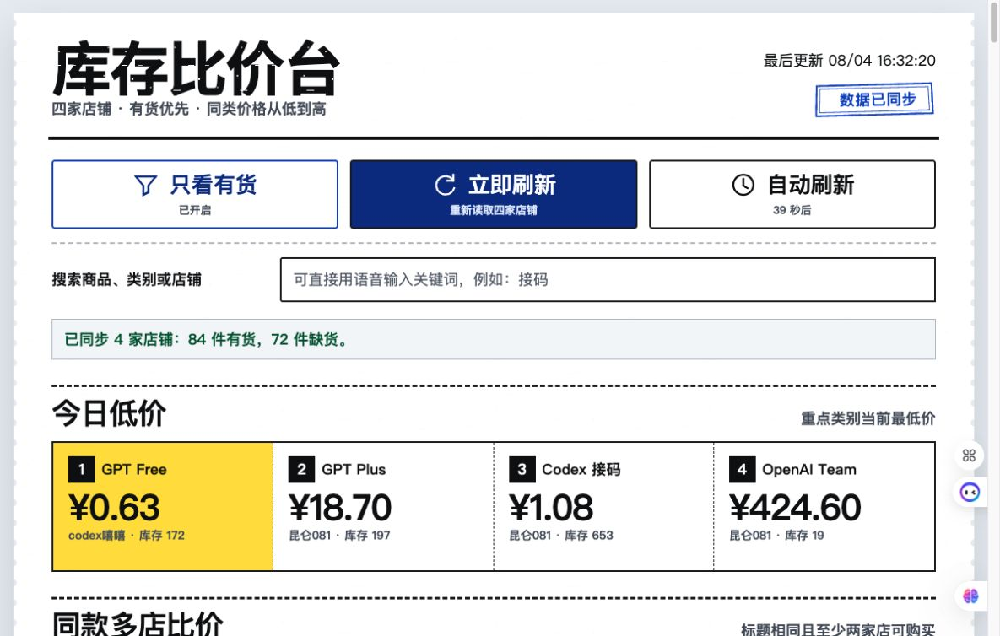
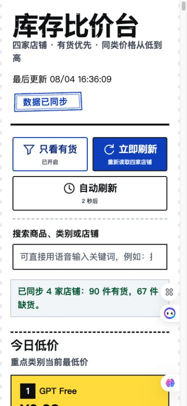

# 号池精选：AI 账号号池库存与价格比价工具

ChatGPT Plus、Codex、OpenAI K12、Claude、Gemini 账号与反代号池的实时库存监控、同款多店比价和价格查询网站。

[](https://stock.ultraai.site)
[](LICENSE)
[](https://www.python.org/)
[](app.js)

在线使用：[https://stock.ultraai.site](https://stock.ultraai.site)



## 为什么写这个项目

这是我自己日常在用的一个反代号池比价网站。

我每天大概会使用 3 到 4 个 Plus 账号，通常分两三次购买。一次买太多容易用不完，账号也存在失效或封号风险；但不同号池的价格和库存会在一天内频繁变化，每次手动打开多个店铺逐个比较都很费时间。

所以我做了“号池精选”：把多个公开店铺里的商品、实时价格和库存汇总到一个页面，默认只展示有货商品，同类按价格从低到高排列，还会把相同商品放在一起做跨店比较。打开网页就能快速判断当前哪里有货、哪家更便宜。

这个工具免费开放给有同样需求的朋友使用。项目也会持续整理反代相关的使用笔记和教程入口。欢迎加微信 `jiangjingruyi6`，一起交流号池、反代和 AI 工具的使用经验。

## 主要功能

- 聚合 4 家公开店铺的商品、价格、库存和商品链接。
- 默认只展示有货商品，缺货商品不会进入默认列表。
- 同类商品按新鲜度和价格排序，旧数据会标明来源时间且不会被标成最低价。
- 自动识别相同标题的跨店商品，集中展示多店价格。
- 支持 ChatGPT Plus、Codex、OpenAI K12、Claude、Gemini、Grok、邮箱等分类。
- 支持按商品名、类别或店铺即时搜索。
- 每 5 分钟自动刷新；手动刷新会真实重读上游，并使用 30 秒全局冷却和并发合并保护数据源。
- 上游暂时不可用时保留最近一次成功库存，并明确标记“部分同步”。
- 提供受密码保护的访问统计后台，按天查看估算独立 IP、访问次数和停留时长。
- 桌面端和手机端自适应，无横向表格拖动。
- 不收集账号、密码、支付信息或原始 IP，购买仍在原店铺完成。

手机端界面：



## 适合谁

- 每天需要少量、多次购买 ChatGPT Plus 或 Codex 账号的人。
- 需要比较不同 OpenAI 号池库存与日内价格的人。
- 使用反代服务、希望快速找到当前有货商品的人。
- 想自建 AI 账号库存监控或价格聚合页面的开发者。
- 想学习原生 Python、JavaScript 和 Cloudflare Tunnel 部署的小项目作者。

## 技术特点

项目运行时不需要第三方 Python 依赖：

- 后端：Python 标准库 HTTP 服务。
- 前端：原生 HTML、CSS 和 JavaScript。
- 发布：Cloudflare HTTPS + Tunnel。
- 可选回滚：Cloudflare Worker。
- 数据保护：共享刷新缓存、请求节流和原子库存快照。
- 隐私统计：SQLite、每日 HMAC 匿名访客标识、机器人过滤、滥用限流和可见页面停留时长。
- 运维保障：滚动访问日志、SQLite 一致性备份、内外网健康与完整库存监控。

```text
浏览器
  -> Cloudflare HTTPS / Tunnel
  -> 127.0.0.1:18768
  -> Python server.py
  -> 店铺公开库存接口
```

## 快速开始

### Windows

双击 `启动库存比价.bat`。浏览器会自动打开；命令窗口保持开启即可。

### macOS / Linux

需要 Python 3.11 或更高版本：

```bash
python3 server.py --open
```

也可以只启动服务：

```bash
python3 server.py --host 127.0.0.1 --port 8765 --exact-port
```

然后访问 `http://127.0.0.1:8765/`。

## 配置店铺

数据源在 `server.py` 的 `SHOPS` 中集中配置。每个店铺使用公开的 `pay.ldxp.cn` 店铺标识；服务只访问代码中明确列出的目标，不接受浏览器传入任意远端 URL。

新增或替换店铺后，先运行自检和单次采集：

```bash
python3 server.py --self-test
python3 server.py --fetch-once
```

分类与“同款”判断使用辅助关键词，只用于提高比价效率，不代表商品规格、质保、售后或质量完全相同。

## 部署到自己的域名

推荐使用 Cloudflare Tunnel，把公网域名转发到本机回环端口：

```yaml
ingress:
  - hostname: stock.example.com
    service: http://127.0.0.1:18768
  - service: http_status:404
```

后台服务启动命令：

```bash
python3 server.py --host 127.0.0.1 --port 18768 --exact-port
```

macOS 可参考 `deployment/macos/com.ultraai.stock-comparison.plist` 配置 LaunchAgent。使用前把其中的 `YOUR_USER` 和项目路径替换成自己的实际路径；示例明确使用受支持的 Python 3.11 运行时。

项目保留了 `cloudflare/worker.mjs` 作为可选 Worker 实现。部分上游会对数据中心或 Worker 出口触发 ESA 人机验证，因此正式使用前必须从实际生产链路验证库存接口；若 Worker 出口受限，使用具备稳定出口的主机配合 Tunnel。

回退包从仓库源文件重新生成，不复制后台资源：

```bash
cd cloudflare
npm ci --ignore-scripts
npm test
npm run deploy:dry-run
npm run deploy
```

Worker 回退版对前端分析 POST 返回安全空响应，但不持久化统计，也不提供 `/admin`；正式后台只存在于 Python + SQLite 部署。

## 访问统计后台

Python 服务会在 `/admin` 提供密码保护的统计后台，默认用户名为 `admin`。首次部署前在项目运行目录生成一个至少 20 位的随机密码：

```bash
openssl rand -base64 32 > analytics-admin-password.txt
chmod 600 analytics-admin-password.txt
```

启动服务后访问 `https://你的域名/admin`，浏览器会要求输入用户名和密码。也可以通过环境变量 `ANALYTICS_ADMIN_USER`、`ANALYTICS_ADMIN_PASSWORD_FILE` 和 `ANALYTICS_DB_FILE` 更改默认位置或用户名；生产环境不建议把明文密码直接写入命令、LaunchAgent 或仓库。

统计口径与隐私边界：

- 估算独立 IP：原始 IP 经“日期 + 本机随机密钥”进行 HMAC 匿名化，同一个 IP 每天只计一次，跨天不可关联。
- 估算访问次数：每次打开页面创建一个独立会话，同一 IP 一天可以有多次访问；相同会话标识来自不同 IP 时分别计数。
- 停留时长：页面可见时每 15 秒上报一次，后台展示每日平均和总停留时长；关闭浏览器、断网或休眠可能造成少量误差。
- 过滤与限流：明显机器人不会入库；单 IP 上报速率和单匿名访客每日新会话数均设上限。
- 数据保留：默认保留 90 天；`analytics.sqlite3`、匿名化密钥和后台密码均已加入 `.gitignore`。
- 局限：脚本拦截、共享公网 IP、未识别爬虫和网络中断都会产生误差，因此这些指标只用于趋势判断，不等同于精确人数。

## 刷新与降级策略

- 普通读取共享 290 秒缓存；手动刷新会绕过普通缓存，但 30 秒内复用最近一次手动结果。
- 并发刷新使用单飞锁，同一时刻只向四家店铺发起一轮采集。
- 上游请求启动时间至少间隔 250 ms，避免瞬时突发。
- 最近一次成功库存会原子写入 `inventory-cache.json`。
- 持久化快照最多每 15 分钟更新一次。
- 服务重启且上游不可用时，页面继续显示旧数据、保留原始采集时间，并禁止旧数据获得最低价标记。
- `inventory-cache.json` 不属于公开静态资源，不可通过网页访问。

## 测试

安装固定版本的浏览器测试依赖：

```bash
python3.11 -m venv .venv
.venv/bin/python -m pip install -r requirements-dev.txt
.venv/bin/playwright install chromium
```

后端、客户端和浏览器检查：

```bash
python3 server.py --self-test
python3 -m unittest -v server_test.py analytics_test.py ops_test.py
python3 -m py_compile server.py server_test.py analytics_test.py ops.py ops_test.py browser_test.py launcher_test.py
node --test analytics_client.test.mjs
.venv/bin/python browser_test.py
```

Cloudflare Worker 测试：

```bash
cd cloudflare
npm ci --ignore-scripts
npm test
npm run deploy:dry-run
```

GitHub Actions 会在 Linux 上运行 Python、Node、Worker dry-run 和 Chromium 测试，并在 Windows runner 上真实执行批处理启动器。

## 备份与监控

手动创建经过 SQLite 完整性校验的备份：

```bash
python3 ops.py backup --database analytics.sqlite3 --backup-dir backups --keep 14
```

同时检查本机服务和公网域名；任何一端健康失败、库存 `partial` 或新鲜店铺数不完整都会返回非零状态：

```bash
python3 ops.py monitor \
  --base-url http://127.0.0.1:18768/ \
  --base-url https://stock.ultraai.site/
```

`deployment/macos/` 内另有每日备份和每 5 分钟监控的 LaunchAgent 模板。运维日志会滚动保留，最近一次监控结果写入已忽略的 `monitor-state.json`。

## 项目结构

```text
stock-comparison/
├── index.html                 # 页面结构
├── styles.css                # 响应式界面与设计系统
├── app.js                    # 搜索、筛选、渲染与刷新逻辑
├── analytics.js              # 匿名访问与可见停留时长上报
├── admin.html/css/js         # 受保护的访问统计后台
├── server.py                 # Python 服务、采集、缓存、统计与降级
├── server_test.py            # 分类、刷新、陈旧数据、缓存和 SEO 回归测试
├── analytics_test.py         # 统计后端和鉴权测试
├── analytics_client.test.mjs # 浏览器统计逻辑测试
├── ops.py / ops_test.py      # SQLite 备份和生产监控
├── browser_test.py           # 固定数据的浏览器端到端测试
├── launcher_test.py          # 启动器测试
├── assets/                   # 轻量票据纹理和状态章资源
├── cloudflare/               # 可复现 Worker 回退构建与测试
├── .github/workflows/ci.yml  # Linux、浏览器、Worker 和 Windows CI
├── deployment/macos/         # LaunchAgent 示例
└── evidence/                 # 公开界面截图
```

## 数据、安全与风险说明

- 本项目只汇总目标店铺公开接口返回的信息，不提供账号交易或支付服务。
- 页面中的价格、库存和商品说明可能因缓存、网络或上游限制而延迟。
- 账号类商品可能存在失效、封号、售后和使用条款风险，购买前请在原店铺核对。
- 请遵守相关平台、店铺和所在地的服务条款及法律法规。
- ChatGPT、OpenAI、Codex、Claude、Gemini 和 Grok 等名称归各自权利人所有；本项目与这些品牌无官方关联。

## 交流与贡献

欢迎提交 Issue 或 Pull Request，也欢迎分享新的店铺适配、分类规则、部署经验和反代教程。

微信：`jiangjingruyi6`

添加时可以备注“号池精选”或“GitHub”，方便我了解你的使用场景。

## 搜索关键词

号池精选、AI 账号比价、AI 账号号池、OpenAI 号池、ChatGPT Plus 账号、ChatGPT Plus 比价、ChatGPT Plus 库存、Codex 账号、Codex 号池、OpenAI K12、反代号池、反代教程、账号库存监控、账号价格监控、实时比价网站、Claude 账号、Gemini 账号、Grok 账号、AI account pool、ChatGPT price tracker、OpenAI account price comparison、Codex account stock monitor。

## License

[MIT](LICENSE)
